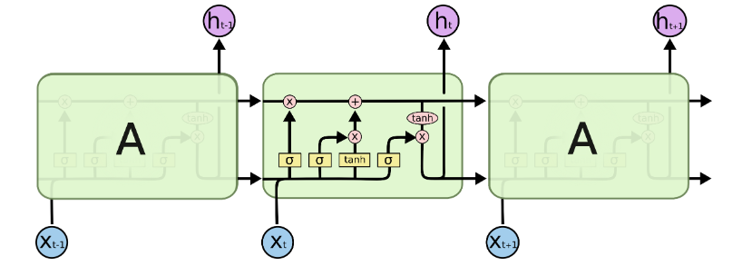
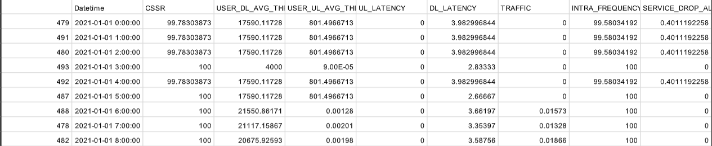
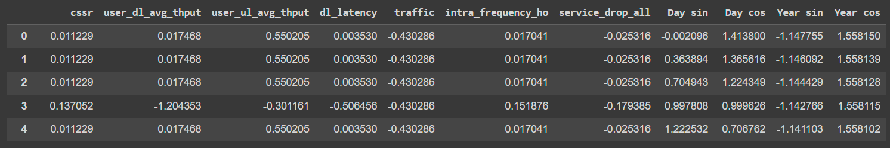
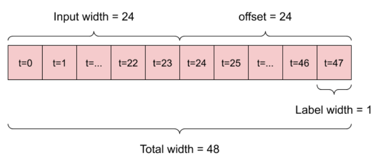
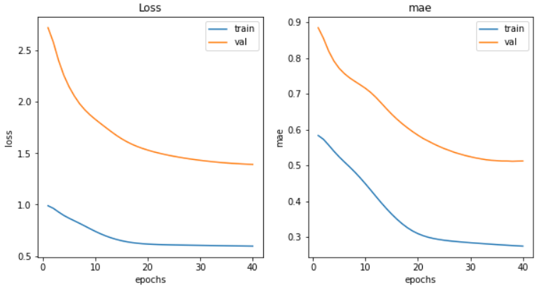

# VNPT-Time-Series
My report: [VNPT-Time-Series Report(Vietnamese)](https://www.overleaf.com/read/dwsxztwpqnzk)
## Long Short Term Memory - LSTM
Original paper: [tf.keras.layers.LSTM](https://www.tensorflow.org/api_docs/python/tf/keras/layers/LSTM)

<div align="center">
    
</div>
<p align="center">
    <strong>Figure 1:</strong> LSTM architecture
</p>

## Dataset
Dataset including the value of 9 KPIs in real time.

<div align="center">
    
</div>
<p align="center">
    <strong>Figure 2:</strong> Dataset
</p>
To deal with the periodicity, we used sine and cosine transformations to remove the "Time of Day" and "Time of Year" signals.

<div align="center">
    
</div>
<p align="center">
    <strong>Figure 3:</strong> Dataset after processing
</p>

## Run model
### Data windowing
More about data windowing in time series forecasting: [Data windowing](https://www.tensorflow.org/tutorials/structured_data/time_series#data_windowing)

<div align="center">
    
</div>
<p align="center">
    <strong>Figure 4:</strong> Data windowing
</p>

For this problem, i will predict the next 24 times based on the past 24 times. 

```
OUT_STEPS = 24
multi_window = WindowGenerator(input_width=24,
                               label_width=OUT_STEPS,
                               shift=OUT_STEPS)
multi_window.plot()
multi_window
```
### Training
* Training process with 40 epochs.
* Use `early stopping` in mode `min` to avoid overfitting.
* The optimal algorithm is Adam with a learning rate of 5 × $10^{-5}$ to accelerate the learning rate with a low learning rate.
* Use mae as loss function during model optimization.
```
early_stopping = tf.keras.callbacks.EarlyStopping(monitor='val_loss',
                                patience=patience,
                                mode='min')
  model.compile(loss=tf.losses.MeanSquaredError(),
                optimizer=tf.optimizers.Adam(learning_rate = 0.00005),
                metrics=[tf.metrics.MeanAbsoluteError()])
```
## Result
<div align="center">
    
</div>
<p align="center">
    <strong>Figure 5:</strong> Result of training process
</p>